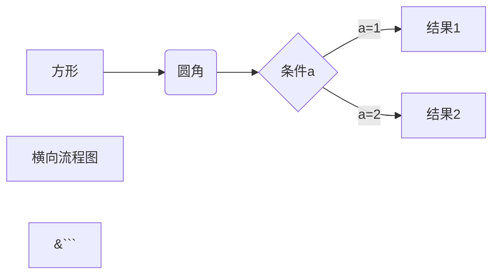
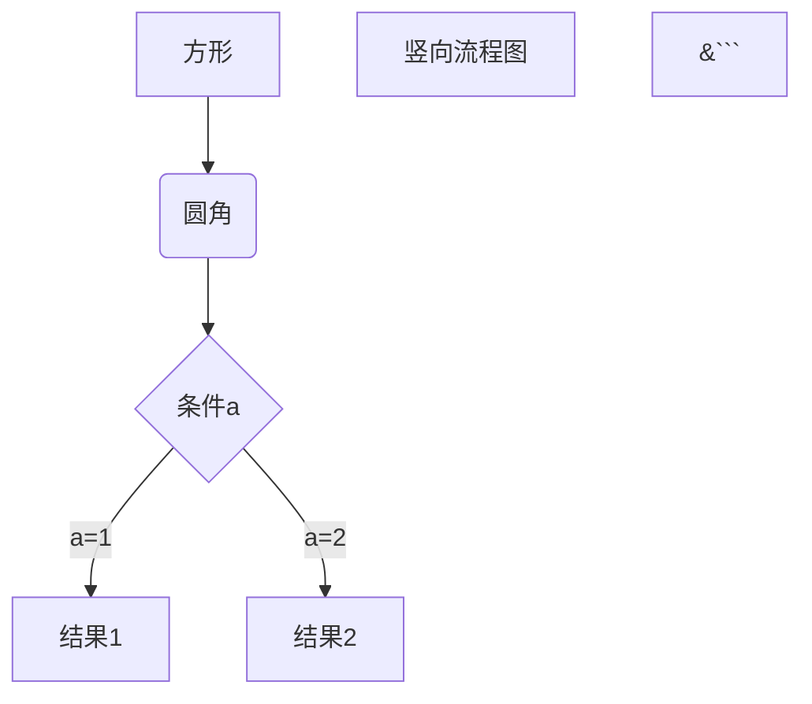

# 一. 标题

在想要设置为标题的文字前面加#来表示一个#是一级标题，二个#是二级标题，以此类推。支持六级标题。

注：标准语法一般在#后跟个空格再写文字，貌似简书不加空格也行。

示例：

```
# 这是一级标题
## 这是二级标题
### 这是三级标题
#### 这是四级标题
##### 这是五级标题
###### 这是六级标题

```

效果如下：

# 这是一级标题

## 这是二级标题

### 这是三级标题

#### 这是四级标题

##### 这是五级标题

###### 这是六级标题

---

# 二. 字体

- 加粗

要加粗的文字左右分别用两个*号包起来

- 斜体

要倾斜的文字左右分别用一个*号包起来

- 斜体加粗

要倾斜和加粗的文字左右分别用三个*号包起来

- 删除线

要加删除线的文字左右分别用两个~~号包起来

示例：

```
**这是加粗的文字**
*这是倾斜的文字*`
***这是斜体加粗的文字***
~~这是加删除线的文字~~
```

效果如下：

**这是加粗的文字**
*这是倾斜的文字*`
***这是斜体加粗的文字***
~~这是加删除线的文字~~

---

# 三. 引用

在引用的文字前加>即可。引用也可以嵌套，如加两个>>三个>>>

n个...

貌似可以一直加下去，但没神马卵用

示例：

```
>这是引用的内容
>>这是引用的内容
>>>>>>>>>>这是引用的内容
```

效果如下：

>这是引用的内容
>>这是引用的内容
>>
>>>>>>>>>>这是引用的内容


---

# 四. 分割线

```
---
----
***
*****
```


---

# 五. 图片

语法

```


图片alt就是显示在图片下面的文字，相当于对图片内容的解释。
图片title是图片的标题，当鼠标移到图片上时显示的内容。title可加可不加
```

示例: 最好搭建个图床用外链来

```
%E9%85%8D%E7%BD%AE/%E8%BD%AF%E4%BB%B6%E4%BD%BF%E7%94%A8%E6%95%99%E7%A8%8B/Markdown/%E5%9F%BA%E6%9C%AC%E8%AF%AD%E6%B3%95-01.jpg)
```

效果如下

%E9%85%8D%E7%BD%AE/%E8%BD%AF%E4%BB%B6%E4%BD%BF%E7%94%A8%E6%95%99%E7%A8%8B/Markdown/%E5%9F%BA%E6%9C%AC%E8%AF%AD%E6%B3%95-01.jpg)

上传本地图片直接点击导航栏的图片标志，选择图片即可

markdown格式追求的是简单、多平台统一。那么图片的存储就是一个问题，需要用图床，提供统一的外链，这样就不用在不同的平台去处理图片的问题了。才能做到书写一次，各处使用。这里我才用的是github来充当图床

---

# 六：超链接

语法：

```
[超链接名](超链接地址 "超链接title")
title可加可不加
```

示例:

```
[简书](http://jianshu.com)
[百度](http://baidu.com)
```

效果如下:

[简书](http://jianshu.com)

[百度](http://baidu.com)

注：Markdown本身语法不支持链接在新页面中打开，别的平台可能就不行了，如果想要在新页面中打开的话可以用html语言的a标签代替。

```
<a href="超链接地址" target="_blank">超链接名</a>
```

示例:

<a href="https://www.jianshu.com/u/1f5ac0cf6a8b" target="_blank">简书</a>

---

# 七: 列表

## 无序列表

语法：

无序列表用 - + * 任何一种都可以

```
- 列表内容
+ 列表内容
* 列表内容

注意：- + * 跟内容之间都要有一个空格
```

效果如下：

 - 列表内容
    - 子内容
      	- 孙内容

+ 列表内容

* 列表内容

## 有序列表

语法：

数字加点

```
1. 列表内容
2. 列表内容
3. 列表内容

注意：序号跟内容之间要有空格
```

效果如下：

1. 列表内容
2. 列表内容
3. 列表内容

## 列表嵌套

上一级和下一级之间敲三个空格即可

- 一级无序列表内容

- - 二级无序列表内容
  - 二级无序列表内容
  - 二级无序列表内容

- 一级无序列表内容

- 1. 二级有序列表内容
  2. 二级有序列表内容
  3. 二级有序列表内容

1. 一级有序列表内容

- - 二级无序列表内容
  - 二级无序列表内容
  - 二级无序列表内容

1. 一级有序列表内容

- 1. 二级有序列表内容
  2. 二级有序列表内容
  3. 二级有序列表内容

---

# 八: 表格

语法：

```
表头|表头|表头
---|:--:|---:
内容|内容|内容
内容|内容|内容

第二行分割表头和内容。

|  姓名   | 技能  | 排行  |
|  ----  | ----  | ----  |
|  小王   | 玩 | 第一 |
| 小李  | 睡 | 第二 |
```

示例:

|  姓名   | 技能  | 排行  |
|  ---- |---  |----  |
|  小王   | 玩 | 第一 |
| 小李  | 睡 | 第二 |

---

# 九:代码

语法：

单行代码：代码之间分别用一个反引号包起来

```
  `代码内容`
```

代码块：代码之间分别用三个反引号包起来，且两边的反引号单独占一行

``` 
(```)
  代码...
  代码...
  代码...
(```)
```

注：为了防止转译，前后三个反引号处加了小括号，实际是没有的。这里只是用来演示，实际中去掉两边小括号即可。

示例：

单行代码

`create database hero`

代码块

```
    function fun(){
         echo "这是一句非常牛逼的代码";
    }
    fun();
```

---

# 十. 流程图

语法：

```
​```flow
st=>start: 开始
op=>operation: My Operation
cond=>condition: Yes or No?
e=>end
st->op->cond
cond(yes)->e
cond(no)->op
&```
```

效果如下：

```flow
st=>start: 开始
op=>operation: My Operation
cond=>condition: Yes or No?
e=>end
st->op->cond
cond(yes)->e
cond(no)->op
&```
```

以下几个实例效果图如下：

**1、横向流程图源码格式：**

```
​```mermaid
graph LR
A[方形] -->B(圆角)
    B --> C{条件a}
    C -->|a=1| D[结果1]
    C -->|a=2| E[结果2]
    F[横向流程图]
&```
```

效果:




**2、竖向流程图源码格式：**

```
​```mermaid
graph TD
A[方形] --> B(圆角)
    B --> C{条件a}
    C --> |a=1| D[结果1]
    C --> |a=2| E[结果2]
    F[竖向流程图]
&```
```

效果:



**3、标准流程图源码格式：**

```
​```flow
st=>start: 开始框
op=>operation: 处理框
cond=>condition: 判断框(是或否?)
sub1=>subroutine: 子流程
io=>inputoutput: 输入输出框
e=>end: 结束框
st->op->cond
cond(yes)->io->e
cond(no)->sub1(right)->op
&```
```

效果:

```flow
st=>start: 开始框
op=>operation: 处理框
cond=>condition: 判断框(是或否?)
sub1=>subroutine: 子流程
io=>inputoutput: 输入输出框
e=>end: 结束框
st->op->cond
cond(yes)->io->e
cond(no)->sub1(right)->op
&```
```

**4、标准流程图源码格式（横向）：**

```
​```flow
st=>start: 开始框
op=>operation: 处理框
cond=>condition: 判断框(是或否?)
sub1=>subroutine: 子流程
io=>inputoutput: 输入输出框
e=>end: 结束框
st(right)->op(right)->cond
cond(yes)->io(bottom)->e
cond(no)->sub1(right)->op
&```
```

效果:

```flow
st=>start: 开始框
op=>operation: 处理框
cond=>condition: 判断框(是或否?)
sub1=>subroutine: 子流程
io=>inputoutput: 输入输出框
e=>end: 结束框
st(right)->op(right)->cond
cond(yes)->io(bottom)->e
cond(no)->sub1(right)->op
&```
```

**5、UML时序图源码样例：**

```
​```sequence
对象A->对象B: 对象B你好吗?（请求）
Note right of 对象B: 对象B的描述
Note left of 对象A: 对象A的描述(提示)
对象B-->对象A: 我很好(响应)
对象A->对象B: 你真的好吗？
&```
```

效果:

```sequence
对象A->对象B: 对象B你好吗?（请求）
Note right of 对象B: 对象B的描述
Note left of 对象A: 对象A的描述(提示)
对象B-->对象A: 我很好(响应)
对象A->对象B: 你真的好吗？
&```
```

**6、UML时序图源码复杂样例：**

```
​```sequence
Title: 标题：复杂使用
对象A->对象B: 对象B你好吗?（请求）
Note right of 对象B: 对象B的描述
Note left of 对象A: 对象A的描述(提示)
对象B-->对象A: 我很好(响应)
对象B->小三: 你好吗
小三-->>对象A: 对象B找我了
对象A->对象B: 你真的好吗？
Note over 小三,对象B: 我们是朋友
participant C
Note right of C: 没人陪我玩
&```
```

效果:

```sequence
Title: 标题：复杂使用
对象A->对象B: 对象B你好吗?（请求）
Note right of 对象B: 对象B的描述
Note left of 对象A: 对象A的描述(提示)
对象B-->对象A: 我很好(响应)
对象B->小三: 你好吗
小三-->>对象A: 对象B找我了
对象A->对象B: 你真的好吗？
Note over 小三,对象B: 我们是朋友
participant C
Note right of C: 没人陪我玩
&```
```

**7、UML标准时序图样例**

```
​```mermaid
%% 时序图例子,-> 直线，-->虚线，->>实线箭头
  sequenceDiagram
    participant 张三
    participant 李四
    张三->王五: 王五你好吗？
    loop 健康检查
        王五->王五: 与疾病战斗
    end
    Note right of 王五: 合理 食物 <br/>看医生...
    李四-->>张三: 很好!
    王五->李四: 你怎么样?
    李四-->王五: 很好!
&```
```

效果:

```mermaid
%% 时序图例子,-> 直线，-->虚线，->>实线箭头
  sequenceDiagram
    participant 张三
    participant 李四
    张三->王五: 王五你好吗？
    loop 健康检查
        王五->王五: 与疾病战斗
    end
    Note right of 王五: 合理 食物 <br/>看医生...
    李四-->>张三: 很好!
    王五->李四: 你怎么样?
    李四-->王五: 很好!
&```
```

**8、甘特图样例：**

```
​```mermaid
graph LR
A[方形] -->B(圆角)
    B --> C{条件a}
    C -->|a=1| D[结果1]
    C -->|a=2| E[结果2]
    F[横向流程图]
&```
```

效果:

